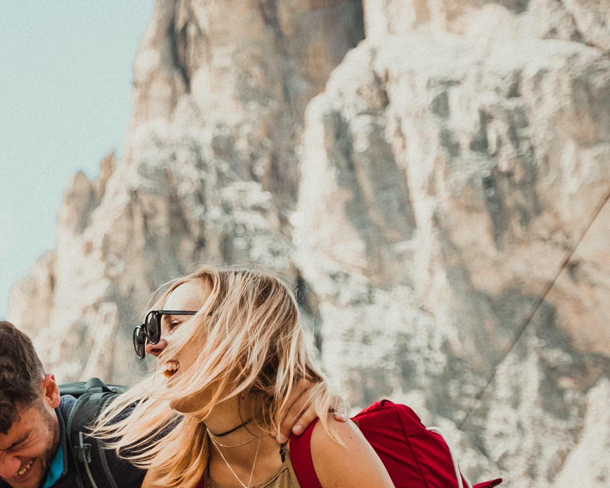
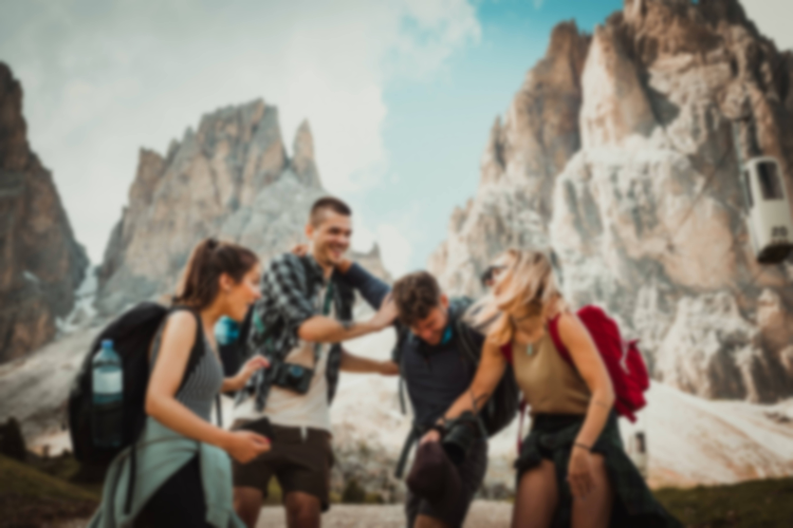
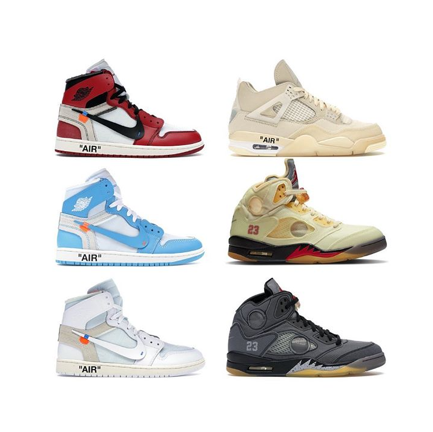
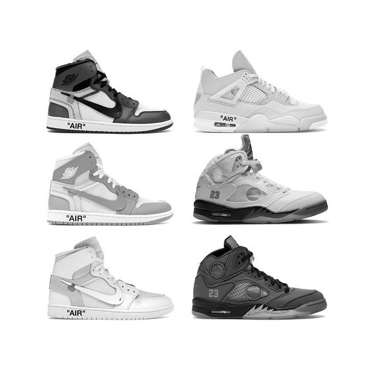
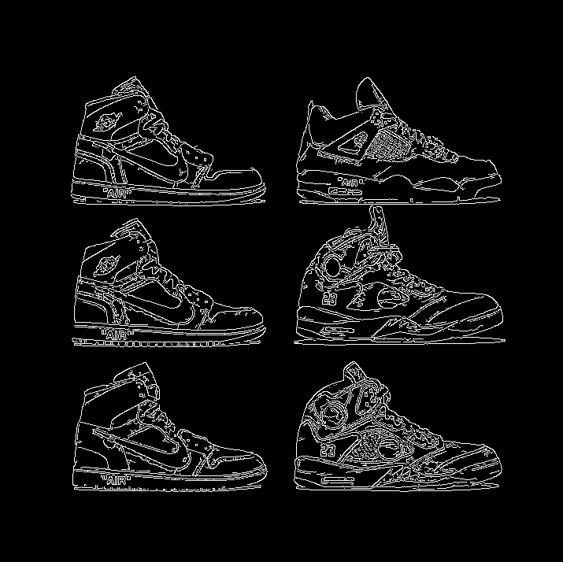
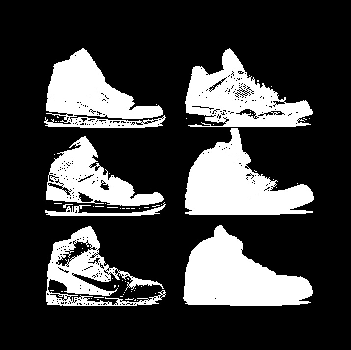
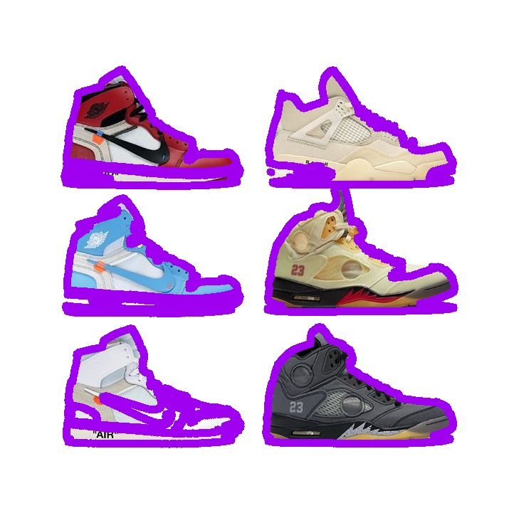
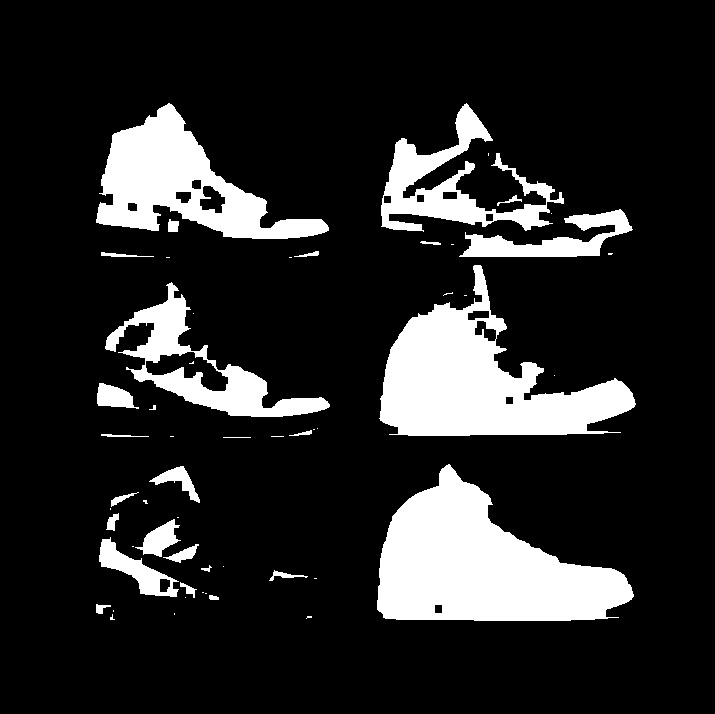
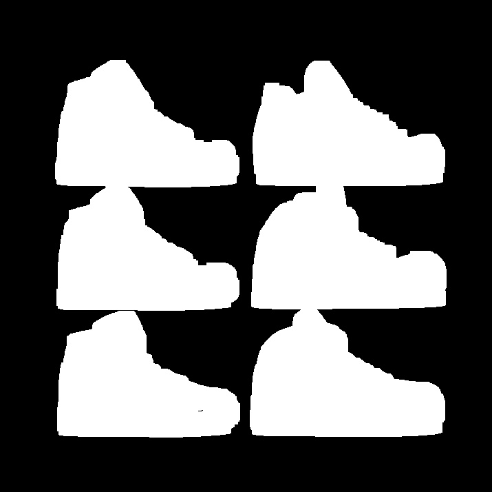
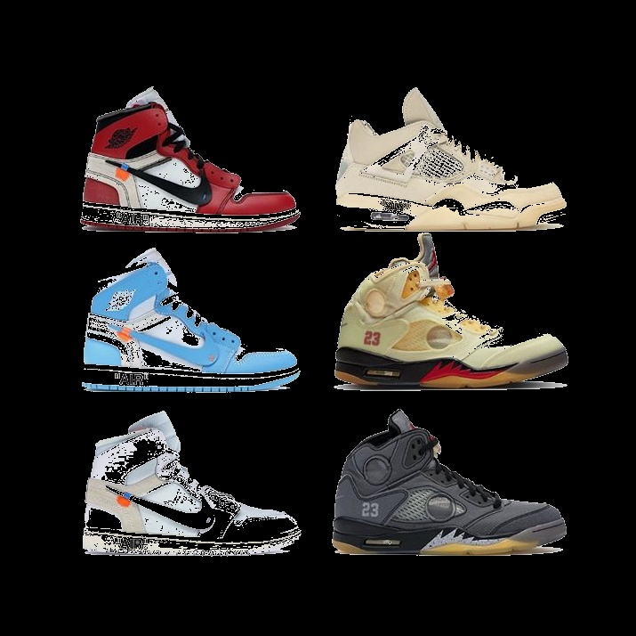

# `OpenCV`

### Zadania zostały wykonane na podstawie instruktażu ze strony:
##### https://www.pyimagesearch.com/2018/07/19/opencv-tutorial-a-guide-to-learn-opencv/

#
## Wczytanie, wyświetlenie oraz zapisanie obrazu

`image = cv2.imread("felix-rostig-UmV2wr-Vbq8-unsplash.jpg")
cv2.imshow("Image", image)
cv2.waitKey(0)
cv2.destroyAllWindows()
cv2.imwrite("Output/unprocessed-image.jpg",image)`

# 
## Otrzymanie danych na temat obrazu

`(h, w, d ) = image.shape
print("width={}, height={}, depth={}".format(w, h, d))
`

# 
## Otrzymanie danych na temat indywidualnych pikseli

`(B, G, R) = image[100, 50]
print("R={}, G={}, B={}".format(R, G, B))`

# 
## Przycinanie obrazu

`cropped = image[1000:2600, 3200:5200]
`

Obraz jest zapisywany jako tablica danych, więc rozmiary wycinku muszą być zdefiniowane na podstawie danych z tablicy 

# 
## Zmiana wielkości obrazu ignorując proporcje

`resized = cv2.resize(image, (200, 200))
`

# 
## Zmiana wielkości obraz obliczając wysokość na podstawie proporcji oryginalnego obrazu

`r = 300.0 / w
dim = (300, int(h * r))
aspect_resized = cv2.resize(image, dim)
`

# 
## Zmiana wielkości obrazu przy pomocy imutils

`imutils_resized = imutils.resize(image, width=300)
`

# 
## Rotacja obrazu

`center = (w // 2, h // 2)
M = cv2.getRotationMatrix2D(center, -45, 1.0)
rotated = cv2.warpAffine(image, M, (w, h))
`

# 
## Rotacja obrazu przy wykorzystaniu imutils

`imutils_rotated = imutils.rotate(image, -45)
`

Obraz jest obracany domyślnie wobec jego środka. Nie musimy, więc deklarować dodatkowych operacji obliczeniowych

# 
## Rotacja obrazu przy użyciu imutils bound

`bound_rotated = imutils.rotate_bound(image, 45)
`

Rotacja obrazu jest wykonywana wraz z poprawnym jego skalowaniem

# 
## Rozmycie obrazu

`blurred = cv2.GaussianBlur(image, (99, 99), 0)
`

# 
## Narysowanie prostokąta na obrazie

`
output = image.copy()
cv2.rectangle(output, (2200, 1400), (2800, 2100), (0, 0, 255), 10)
`
Operacja nadpisuje dane obrazu, dlatego pracujemy na jego kopii

# 
## Narysowanie kółka na obrazie

`output = image.copy()
cv2.circle(output, (2500, 1750), 300, (255, 0, 0), 10)
`

#
## Narysowanie czerwonej lini na obrazie
`
output = image.copy()
cv2.line(output, (2000, 2150), (3000, 2500), (0, 0, 255), 10)
`

#
## Utworzenie tekstu na obrazie
`
output = image.copy()
cv2.putText(output, "Some friends having fun", (int(w/4), int(h/4)),
	cv2.FONT_HERSHEY_SIMPLEX, 7, (0, 0, 0), 15)
`

#
## Zmiana koloru obrazu na czarno-biały
`
gray = cv2.cvtColor(jordanXoffwhite, cv2.COLOR_BGR2GRAY)
`
Do kolejnych zadań wykorzystuję inny obraz niż do poprzednich

## Oryginał:

## Obraz po operacji cvtColor():

#
## Rozpoznianie krawędzi
`
edged = cv2.Canny(gray, 30, 150)
`
Metodę Canny() stosujemy do wykrycia krawędzi. Metoda oblicza gradient dla punktów. Wynik jest porównywany z podanym argumentem progu krawędzi. Jeżeli wynik jest większy niż próg punkt zostanie uznany za krawędź.

#
## Przefiltrowanie obrazu
`
thresh = cv2.threshold(gray, 225, 255, cv2.THRESH_BINARY_INV)[1]
`

Threshold zamienia nasze punkty na kolor biały lub czarny zależnie od progu.

#
## Znalezienie oraz oznaczenie kontur

Znalezienie kontur:
`
cnts = cv2.findContours(thresh.copy(), cv2.RETR_EXTERNAL,cv2.CHAIN_APPROX_SIMPLE)
cnts = imutils.grab_contours(cnts)
`

Narysowanie kontur na kopii oryginalnego obrazu:

`output = jordanXoffwhite.copy()
for c in cnts:
    cv2.drawContours(output, [c], -1, (240, 0, 159), 10)
`

#
## Refukcja szumu przy pomocy erode()
`
mask = thresh.copy()
mask = cv2.erode(mask, None, iterations=3)
`

#
## Dylacja obrazu
`
mask = thresh.copy()
mask = cv2.dilate(mask, None, iterations=10)
`

#
## Maskowanie 
`
mask = thresh.copy()
output = cv2.bitwise_and(jordanXoffwhite, jordanXoffwhite, mask=mask)
`

Wersja finalna:
